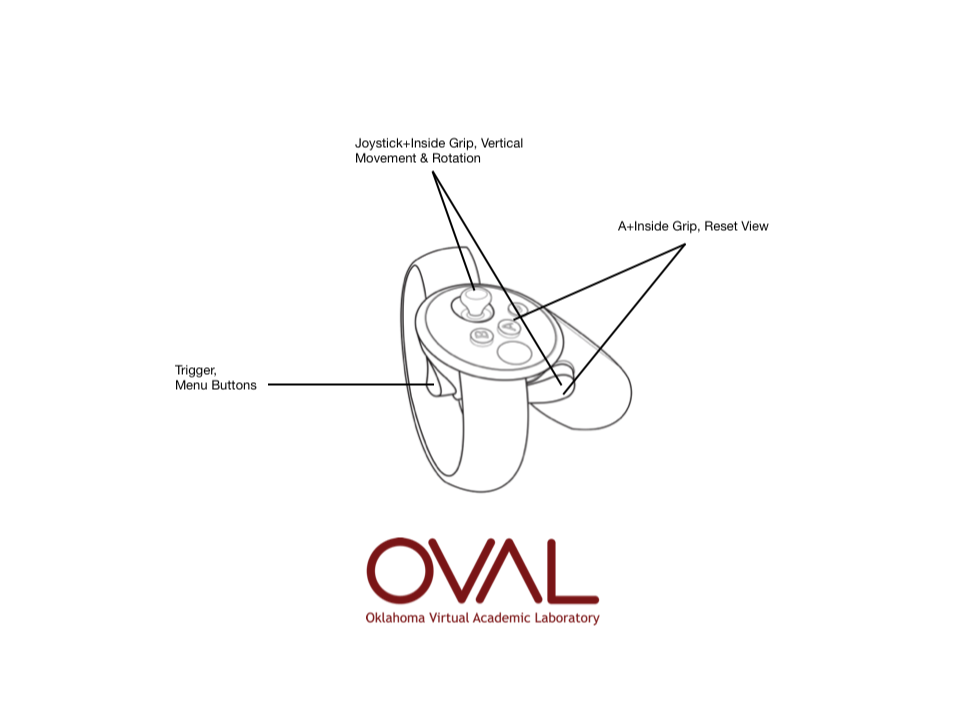
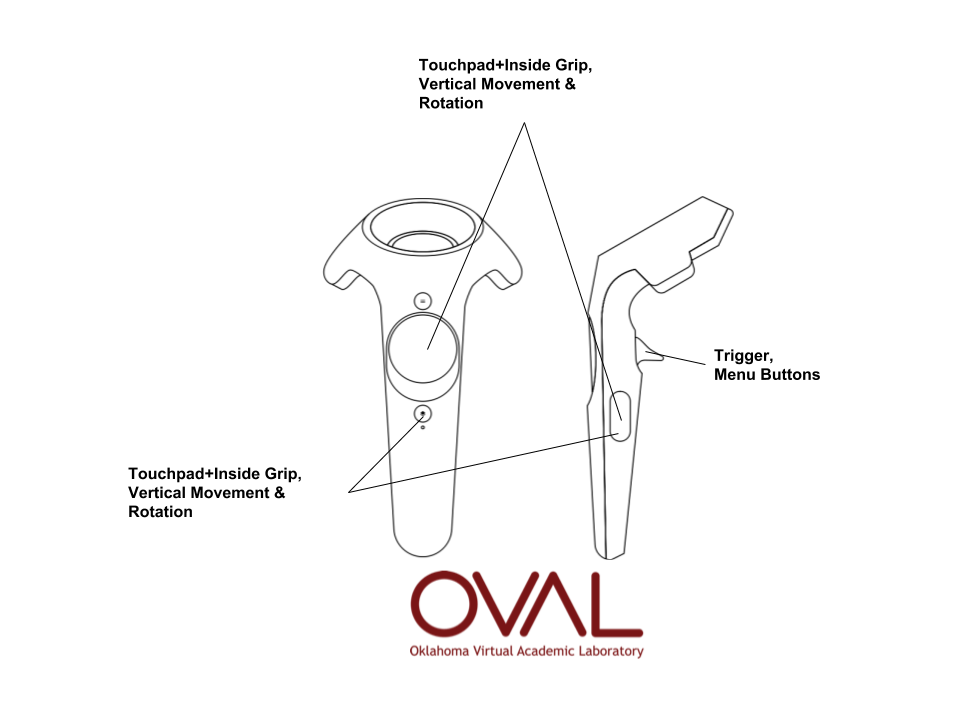
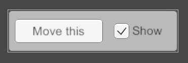
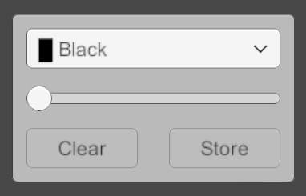
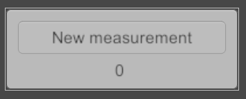
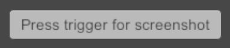
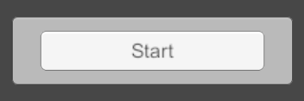

# OVAL (Oklahoma Virtual Academic Labratory)
The Oklahoma Virtual Academic Laboratory (OVAL) is a VR-Classroom application designed to encourage remote collaboration between acdaemics. Up to twenty users can inhabit the same VR space, import 3D content, and analyze 3those models with built-in tools.

## Controls
### Oculus Touch Controls

### HTC Vive Controls

## Menu
Welcome to OVAL! OVAL uses one slim, movable menu to provide you with many functional tools to help analyze or display your 3D content. 

Menu Feature | Notes
----------------------------------------- | -------------
 | The "Move This" button on the top-left of the menu will allow you to place the menu anywhere you like for your viewing convenience. 
 | OVAL is networked and allows users to meet and view 3D models in an online lab. As long as users have the same "room" defined, they will show up in the same space. One user will have complete controls. Any other user will have limited controls. 
 | Specify whether the controller(s) should move you, the scene light source, or the model.
 | This allows you to switch between drag, annotate, indicate, screenshot, and measure modes.
 | This mode allows you to annotate on the model. Your laser will paint on the first surface it touches when you pull the trigger. You can select one color or two colors for a gradient for your annotation color. 
 | Measure mode allows you to place to dots on or around your model. OVAL will tell you the straight-line distance between those two points to assist in measuring the model. 
 | The model load screen will display any models you have added to the model directory. You can also use the button to load files located in other places on your computer. OVAL can be used to view .obj, .stl, .blend, .fbx, and .dae.
 | Apply a clipping plane to models in the scene to enable cutaways and cross-sections through data.
 | Provides screenshots when the controller trigger is pressed.
 | Provides video capture functionality.

# OVAL-related Publications
- [Multi-Campus VR Session Tours Remote Cave Art](https://campustechnology.com/articles/2017/10/09/multi-campus-vr-session-tours-remote-cave-art.aspx)
- [Library Journal - University of Oklahoma Expands Networked Virtual Reality Lab](http://lj.libraryjournal.com/2016/08/academic-libraries/university-of-oklahoma-expands-networked-virtual-reality-lab/)
- [Library Journal - Virtual Reality and How to Build an Interdisciplinary Hub](http://lj.libraryjournal.com/2017/09/academic-libraries/carl-grant-virtual-reality-build-interdisciplinary-hub/#_)
- [The Design & Development of an Immersive Learning System for Spatial Analysis and Visual Cognition](http://static1.squarespace.com/static/532b70b6e4b0dca092974dbe/t/5755e2df20c647f04c95598a/1465246433366/pobercook_text+(1).pdf)
- [Virtual Serendipity: Preserving Embodied Browsing Activity in the 21st Century Research Library](http://www.sciencedirect.com/science/article/pii/S0099133317301520)
- [A Hub for Innovation and Learning](https://campustechnology.com/Articles/2018/01/31/A-Hub-for-Innovation-and-Learning.aspx?Page=1)
****************************************************
